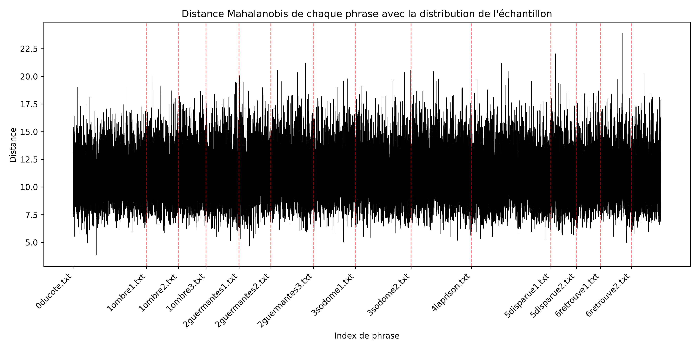
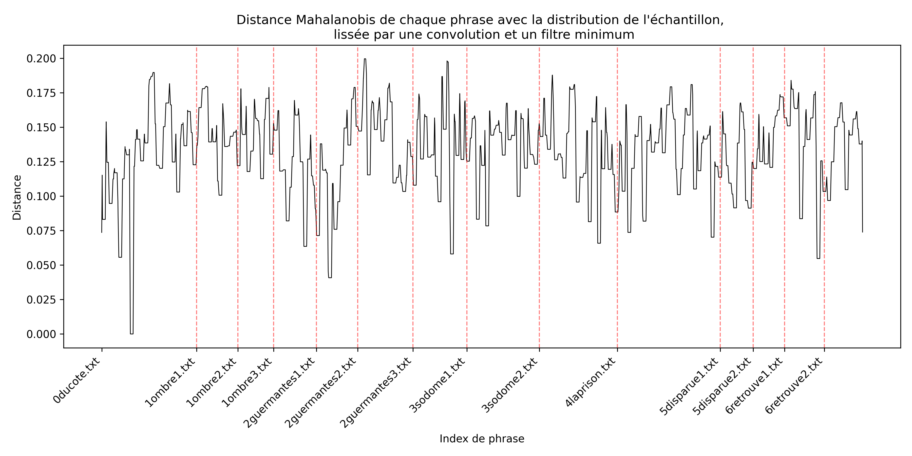

Proust's *La Recherche du Temps perdu* (RTP) is a work rich with depictions of perceptions made by senses other than vision. Amongst them, smell and taste are usually brought forward as they serve the narrator in unlocking forgotten memories. Following (Toth, 2018)[^1] our work focuses on audition and tries to quantify the number of sentences invoking that sense.

We first parse RTP and slice it in units  according to guidelines by (Serça, 2021)[^2]. Then these sentences or half-sentences are embedded in 32 dimensions by means of jina-embeddings-v3 from (Sturua et al., 2024)[^3]. We then  draw inspiration from (Tint, 2025)[^4] to build a sample of our targeted sentences, drawn from articles in (E.Eells, N.Toth, 2018). This sample is treated as that of a probability distribution of the 32 variables in the embeddings. Then, we calculate the Mahalanobis distance of the remaining sentences in RTP to the target distribution.

All sentences in RTP ordered from the closest to the furthest of the target distribution are available in [normes_proximite.csv](./results/normes_proximite.csv). A top 1000 is also provided. We also provide two plots of the RTP per sentence, with the purpose of manually finding excerpts that are more likely to be related to audition.

[^1]:Toth, N. (ed.) (2018) Son et traduction dans l’oeuvre de Proust (1 vol). Paris: Honoré Champion éditeur (Recherches proustiennes, 41).

[^2]:Serça, I. (2021) Les coutures apparentes de “La recherche” :  Proust et la ponctuation (1 vol). Honoré Champion éditeur.

[^3]:Sturua, S. et al. (2024) “jina-embeddings-v3: Multilingual Embeddings With Task LoRA.” arXiv. Available at: https://doi.org/10.48550/arXiv.2409.10173.

[^4]:Tint, J. (2025) “Guardrails, not Guidance: Understanding Responses to LGBTQ+ Language in Large Language Models,” in A. Pranav et al. (eds.) Proceedings of the Queer in AI Workshop. Hybrid format (in-person and virtual): Association for Computational Linguistics, pp. 6–16. Available at: https://doi.org/10.18653/v1/2025.queerinai-main.2.

Shield: [![CC BY-NC-SA 4.0][cc-by-nc-sa-shield]][cc-by-nc-sa]

This work is licensed under a
[Creative Commons Attribution-NonCommercial-ShareAlike 4.0 International License][cc-by-nc-sa].

[![CC BY-NC-SA 4.0][cc-by-nc-sa-image]][cc-by-nc-sa]

[cc-by-nc-sa]: http://creativecommons.org/licenses/by-nc-sa/4.0/
[cc-by-nc-sa-image]: https://licensebuttons.net/l/by-nc-sa/4.0/88x31.png
[cc-by-nc-sa-shield]: https://img.shields.io/badge/License-CC%20BY--NC--SA%204.0-lightgrey.svg

